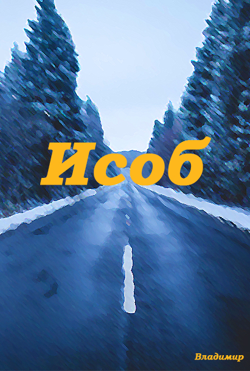
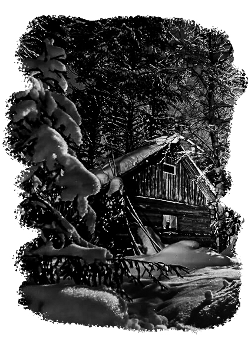
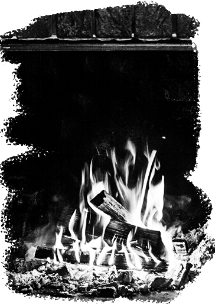
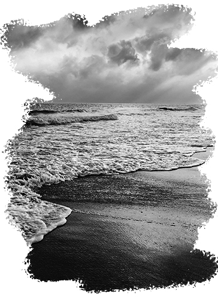
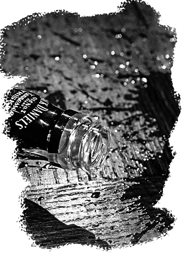
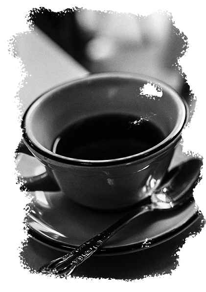
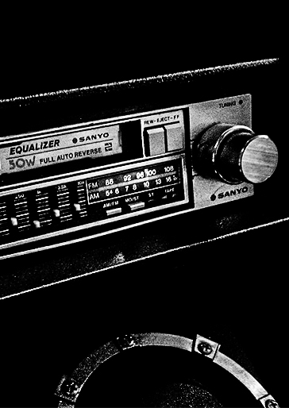
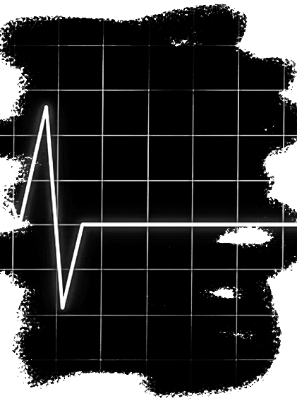

# Исоб



## Оглавление

 - <a href="#chapter1">Глава I. Ночь</a>
 - <a href="#chapter2">Глава II. Кофе</a>
 - <a href="#chapter3">Глава III. Спутник</a>
 - <a href="#chapter4">Глава IV. Рассказ</a>
 - <a href="#chapter5">Глава V. Ресторан</a>
 - <a href="#chapter6">Глава VI. Последние сборы</a>
 - <a href="#chapter7">Глава VII. Прибытие</a>
 - <a href="#chapter8">Глава VIII. Аут</a>

<span id="chapter1">

# Глава I. Ночь

Ночь уже окутала все вокруг своим шарфом из тьмы. Сегодня он не был украшен звездами или огромным брелком луны. Единственное, что можно было заметить и выделить — это снегопад, чья сила росла каждую секунду. В такую погоду приятно находиться дома и наблюдать из окна, как снег кружится в свете одиноко стоящего фонаря. Но не всем в эту ночь была доступна такая роскошь. На загородном шоссе в глубине леса одинокая машина вела нерав-ную борьбу с непогодой. Если заглянуть в саму машину, мы не увидим чего-то экстраординарного. Кожаные сидения, аккуратный вид, открытый бардачок, из которого чуть ли не выпадают игральные карты с салфетками. Над приборной панелью лежит открытая пачка сигарет, а в салоне играет медленная музыка, что затягивает слушателя в раздумья все глубже и глубже. Рядом с лицом водителя вспыхнуло пламя зажигалки и едкий табачный дым начал окутывать салон, который пропах этим дымом насквозь. Водитель продолжал движение, а снегопад уже перерос в метель.

Но водитель был не единственным в этом лесу. Прямо в это же время, сквозь метель, от которой немного спасали деревья, бежал кто-то, если это, конечно, можно назвать бегом. Каждый следующий шаг давался ему сложнее предыдущего, он спотыкался, но упорно продолжал движение. Он четко знал, куда он идет, но понятия не имел, что его будет там ждать — спасение или полная его противоположность. Путник продвигался все дальше и дальше, гонимый лишь ему одному понятным чувством, как вдруг он выпал на ровный участок земли. Сильный удар, что он должен был ощутить, был смягчен свежевыпавшим снегом. Но соприкосновение все равно вышло довольно болезненным. Он искал в себе остатки сил, чтобы подняться, но смог только повернуть голову. Он двинул её и увидел яркий свет, который становился все ярче и будто бы ближе. Страшная мысль появилась в его голове, но он отверг ее и вновь попытался встать. Свет прекратил свое движение и прямо сбоку от него появилась пламенно-красная точка. Постепенно в свете проявился силуэт человека и уже спустя несколько секунд он сел на корточки перед изнемогающим телом.

— Вот черт... Хей, ты еще здесь?

Ответа не последовало.

— Черт. Что делать? Он просто замерзнет здесь, если я его оставлю. Надо звонить в полицию. Или в скорую, — Он достал телефон, но сигнала не было.

— Проклятье! И что же? Мне придется брать его с собой? — он оглянулся, думая, что, может быть, можно свалить это дело на кого-то еще, но все, что он увидел — это снег, деревья и его собственная машина.

— Видимо, у меня нет другого выхода...

Он аккуратно взял его под подмышки и поволок к машине. Кое-как уложил его на заднее сиденье и сел за руль. Что-то ему подсказывало, что ночь будет длинной, а метель не закончится довольно долго.

Водитель завел машину и вновь двинулся в пучину ночи — дальше по шоссе. Он бросал взгляды в зеркало заднего вида, пытаясь узнать что-нибудь о ночном госте. Но ни одежда, ни лицо не давали ему ответов, а создавали больше вопросов. У пассажира не было куртки, что в этих краях считается чуть ли не самоубийством, ведь ночи очень холодны. Он был в классической белой рубашке, что была ему немного велика, в синих джинсах и кедах. Вся его одежда и волосы были покрыты снегом, что медленно таял прямо на кожаные сидения. Местами, снег покрывал его словно тонкой коркой. «Его наряд подошел бы какому-нибудь теплому городу в середине лета, но в этих краях он не мог выйти на улицу ночью в таком!» — думал водитель. Разум его разрывался от вопросов, а предчувствие странно молчало. Он надеялся, что узнает все, когда доедет до пункта назначения.

---

Шоссе закончилось, теперь осталось только что-то наподобие дороги. В скором времени машина остановилась, и водитель вышел из нее. Засунув руки в карманы и попытавшись сжаться, лишь бы укрыться от вездесущего снега, он двинулся в сторону едва видной бревенчатой хижины. Он подошел к двери и достал ключи из кармана — руки уже тряслись от холода и ключ никак не хотел попасть в замочную скважину. Дверь, наконец, открылась и он зашел внутрь.  Воздух внутри хижины был спертым, отчего казалось, что мрак внутри нее был густым и продвигаться в нем было непросто. Войдя внутрь, водитель первым делом достал зажигалку, чтобы хоть как-то освещать себе окружение. Он увидел выключатель, но, нажав на него, ничего не произошло.

<center> 



</center>

— Ах, ну да. Точно. Генератор, — проговорил он себе под нос и вновь вышел на улицу. Обойдя здание вокруг, он нашел дверь, а за ней обнаружил генератор, выглядящий довольно старым, но надежным. На удивление, он заработал практически сразу и, запирая дверь, он уже видел, как немного света проникает через окно. Вернувшись ко входу, он обернулся к машине, раздумывая о том, что же ему делать с пассажиром. Спустя мгновения он стоял около машины и открывал дверь, чтобы затащить своего вынужденного гостя в дом. Водитель уложил его на диван, стоящий посередине комнаты, и оглядел её при свете.

Она не могла похвастаться обильным количеством вещей: диван, пара стульев, небольшой столик перед диваном, книжные полки, камин и чучело головы кабана прямо над камином. В противоположной от входа стены было две двери. С потолка свисала старая лампочка, что еле-еле давала необходимый минимум света. Водитель вновь взглянул на своего гостя при слабом свете он мог уже лучше рассмотреть его. Он наблюдал за ним минуты две и никак не мог понять, что же так сильно вводит его в ступор. Что не так с этим человеком, лежащим на диване? Почему, когда он смотрит на него, он начинает чувствовать диссонанс и еще одно странное чувство, которое он не может объяснить себе самому? Он простоял так еще пару минут, после чего он, все-таки, вышел из своеобразного транса и вновь огляделся. Обратив внимание на двери, он подошел к левой двери и зашел туда. 

Это была кухня с громадным гарнитуром, что занимал большую её часть и казалось, что в его ящиках и шкафах можно сложить столько, что обычному человеку столько не набрать. Также в кухне были два стула и небольшой стол, на котором стояла свеча, она явно использовалась множество раз и теперь от нее осталась лишь маленькая горка воска с торчащим фитилем. Впрочем, это не сильно волновало водителя. Он подошел к шкафу и, открыв его, увидел полностью заставленные тушенкой и макаронами полки. В остальных шкафах также лежали долгохранящиеся продукты: гречка, рис, консервы и вода. Водитель вышел из кухни довольным. Он до сих пор был в куртке, что было не очень удобно. Он снял ее и положил ее на своего гостя. Он уже собирался идти осмотреть вторую комнату, но возле правой двери в его взгляд бросились дрова. Тогда он решил, что лучше сперва обеспечить дом источником тепла, ведь в хижине было, мягко говоря, прохладно. Он начал разжигать огонь в камине и уже спустя некоторое время тепло начало постепенно окутывать комнату. Довольный собой, он вновь пошел к правой двери, но только взявшись за ручку он услышал сдавленный стон позади себя. От неожиданности он вздрогнул и развернувшись увидел, как его куртка медленно сползала с уже открывшего глаза гостя. Водитель не был параноиком, но что-то заставило его отвести руку за спину и положить ее на рукоять пистолета, что был аккуратно спрятан между его телом и джинсами. 

Стон вновь прозвучал в тиши комнаты. 

— Приятель, ты как? - спросил водитель

— Я... я. Я в порядке. Я можно попросить вода?

— Попросить воды? Да, конечно, сейчас, — сказал водитель, направляясь в сторону кухни. Краем глаза он заметил, как странный гость подбирает куртку и накрывается ей, словно одеялом. Наливая воду в стакан, водитель никак не мог отделаться от странного чувства и мыслей о речи того, кто лежит прямо за дверью. Его искушало желание просто избавиться от него, но при этом что-то останавливало, отвергало эту идею в его сознании. 
Вернувшись в зал, он увидел, что его гость уже сел, но продолжал держать куртку словно щит, который должен защитить его от всего. Весь снег на нем растаял, и только влага осталась на одежде и волосах. Гость внимательно смотрел на огонь, словно пытаясь разглядеть в нем что-то.

— Вот, возьми, — сказал водитель и протянул стакан воды.

— Спа... сибо... друг, — промолвил сидящий и взял стакан воды.

«Друг? Он сказал друг? Да кто он? Что с ним? Больной или, может, сумасшедший? Но в этих краях нет никаких психиатрических больниц. Здесь кругом лес, километров на сто», — думал водитель пока его гость пил воду, дрожащими руками держа стакан. И тут водителя словно молнией ударило понимание того, что же его так настораживало: «Его руки. Они были абсолютно здоровы на вид, как и другие открытые взору участки кожи. Но если вспомнить то, как много снега было на нем, нельзя сказать, что он пробыл на улице совсем немного. Тогда почему на его коже нет никаких следов обморожения? Она лишь немного бледна! Она выглядит абсолютно нормально! Так, спокойно, от паники до безумия лишь шаг. Должно быть логическое объяснение. Спокойно» — так думал водитель. Напряжение в комнате росло, водитель ощущал, что его левый глаз вновь начал дергаться, а рука вновь вернулась за спину, сжимая рукоять пистолета все сильнее. Тем временем гость допил и протянул стакан, попутно благодаря и спрашивая водителя:

— Как тебя зовут?

— Меня? — переспросил водитель. — Меня зовут Майкл. Как зовут тебя? — он не мог понять, что несут за собой действия его гостя. «Он ведет себя, как ребенок. Он словно не помнит, что произошло или хочет, чтобы я так думал. Мне надо попытаться узнать, как можно больше. Мне бы не хотелось убивать его: слишком много проблем с избавлением будет, да и лучше «не шуметь тут».

Его раз-мышления были прерваны неожиданно громким ответом:

— Я Исоб! Рад с тобой познакомиться! — он говорил эти фразы с таким восторгом, словно ожидая награды за каждое из сказанных слов. Это же ожидание Майкл увидел в его глазах.

В секунду напряжение ушло и комнату заполнило что-то теплое. Майкл не мог объяснить, что за скачок он наблюдал, но тело его расслабилось и все боли покинули его. Он убрал руку с пистолета и присел на стул, стоящий сбоку от стола. В камине изредка трещали дрова, нарушая полную тишину, что окутала помещение. Никто из присутствующих не хотел говорить. Исоб внимательно смотрел в огонь, а «друг» наблюдал за ним, погруженный в раздумья. Разум Майкла гудел, мысли нехотя сменялись, а вопросы словно терялись в пучине сознания. Уже привычным движением Майкл достал пачку сигарет из нагрудного кармана рубашки и зажигалку из джинсов.

Он взял длинный белый цилиндр с оранжевым осно-ванием в тонкие изящные руки. Такие руки ценились бы у актера или шоумена — они так и притягивали бы взгляд зри-теля. Но для Майкла они не были чем-то особенным, он привык получать комплименты в их сторону, но слушал их с тихой усмешкой себе под нос. Никто не знает, что было свершено этими руками. Сколько они прошли и, наверное, пройдут, если сейчас все обернется крахом. Он не может этого допустить. Рисковать сейчас - безумие. Упускать этот шанс стать обычным человеком — бред. Майкл понимал это. тем не менее, на диване, прямо перед ним, сидел человек, что может привести его к тому самому концу. Человечность не всегда является другом. С такими мыслями сидел Майкл, поднося сигарету с горящей зажигалкой ко рту. Дым возносился к потолку, медленно исчезая, растворяясь в нем. «Сколько пачек я выкурю до того, как смогу покинуть это место?» — думал Майкл, делая очередную затяжку. Он пе-ревел взгляд на окно — метель все еще бушевала и, каза-лось, конца этому не будет.

— Зачем? — разрушив ауру тишины, спросил Исоб. — Зачем ты это делаешь?

— Что именно? Курю? 

— Да! Зачем ты это делаешь? Ты... ты умираешь.

— Может и так, — отвечал закуривающий водитель. — Но пока это помогает мне, я не собираюсь бросать. Все мы умираем, но с разной скоростью. Я просто добавляю в свою жизнь нечто, что снимает стресс и укорачивает отве-денное мне время, а люди, что не курят, сокращают свою жизнь стрессом, снять который времени нет, а то, что хоть как-то помогает расслабится — для них слишком «вредно», — с некоторой издевкой сказал Майкл, стряхивая пепел с сигареты на листок бумаги, лежащий на столе.

— Это неправильно. Ты не должен курить, — строго сказал Исоб. Его лицо выражало истинную решимость, будто он готов был вырвать сигарету изо рта собеседника и бросить ее прямо в огонь. Он уже никак не походил на беззащитного взрослого ребенка, что сидел на этом диване, накрывшись курткой. 

— Правильно или неправильно. С чего ты решил, что именно *ты* можешь судить об этом? Ты понятия не имеешь, кто я. Ты не вправе судить меня. Я, вообще-то, спас твою жизнь! — раздраженно, чуть ли не агрессивно отвечал Майкл. 
Обычно он не был таким, но последние события и действия весьма тяжело дались ему. Что бы он не говорил, а стресс преследует его, хоть он и пытается всячески подавлять все проявления оного, но он все равно находит пути наружу — через злость и раздражение. Внезапно Майкл по-нял, что боль вновь вернулась и окатила его своей волной. А напряжение вновь обуяло в комнату. 

— А я спасаю твою. *Отдай мне сигарету*, — медленно промолвил Исоб, выговаривая каждое слово по отдельности. В его голосе звучал холод, словно он втянул в себя весь снег с округи, преобразовав в речь. Майкл отнес сигарету от рта, зажав ее между средним и указательным пальцем. Он остолбенел, почувствовав исходящую угрозу от своего гостя. Он видел влиятельных людей, он работал с ними. Некоторые пугали его, некоторые внушали уважение. Но *он* — он был другим. Майкл не мог понять, что же за чувство окутало его. Это не был страх — это было нечто *другое*. Словно все доступные ему чувства взяли и замешали в одном огромном котле и сейчас ему дали испить стакан этого отвара. Исоб требовательно протянул руку и Майкл послушно положил в нее сигарету. Мгновение спустя сигарета уже горела в пламени, под сопровождение, состоящее из треска поленьев.

<span id="chapter2">

# Глава II. Кофе

Комнату вновь наполнило теплой, как будто поглощающей, атмосферой. Вопросы все также крутились в голове у Майкла, но задать он их будто бы не мог. Словно что-то останавливало его от этого. Так они и сидели — молча. Никто из них не проронил ни слова, каждый был погружен в свои мысли. В глазах Исоба плясало отражение пламени, а в глубине зрачка словно читалась тихая грусть. Постепенно он засыпал, погружаясь все глубже в себя. Майкл думал, что не сможет заснуть в эту ночь уж точно, но уже спустя несколько минут он отправился в царство Морфея вслед за Исобом. На удивление, Майкл спал очень крепко, как не спал уже много лет.

В комнате, которая выглядела одновременно просторной и тесной, спало два человека. Один лежал на диване, укрываясь курткой, а второй кое-как приютился на стуле. Угли в камине приветливо светили своим ярко-красным светом, а за окном все мело и мело. Лампочка продолжала висеть, уходя проводом в мрак потолка, а кабан с камина величественно возвышался над всей комнатой, будто она принадлежала только ему, и он милостиво приютил двух странников на время бури. Человек на стуле начал просыпаться, открывать глаза. Он окинул комнату сонным взглядом, будто бы вспоминая, что же он тут делает. Он посмотрел на все еще спящего и тихо усмехнулся себе под нос. Вопросы так и не покинули его, ведь еще с детства любопытство было верным спутником Майкла.

Он тихо поднялся, словно боясь разбудить своего гостя. Хотя, подумав, он понял, что действительно не хочет его разбудить. Он развернулся и вновь увидел так и не открытую им дверь. Еле слышно он продвигался к ней и, открыв, он не увидел ничего сверхъестественного. Это была довольно пустая комната с двуспальной кроватью. В противоположной стене виднелась открытая дверь, за которой, по всей видимости, была ванная комната. Майкл поспешил в нее и через пару минут вышел весьма довольным на вид. Выходя, он, наконец, обратил внимание на большой шкаф прямо напротив кровати. Он был обмотан цепью, сцепленной замком, а на дверце висел небольшой бумажный обрывок. Подойдя ближе, он прочитал: «На крайний случай! Кровать». Майкл догадывался, что лежит в шкафу, и он очень надеялся, что этот случай не наступит. «Однако, если он произойдет, товар этого «гиганта» должен очень помочь мне», — думал он, осторожно проходя мимо. Майкл вышел из комнаты. На диване все еще спал Исоб, а от углей осталась лишь пара красных точек. Так как другого источника тепла в хижине не было, воздух начинал постепенно остывать, но атмосфера в зале все оставалась душевно мягкой. Он взял оставшиеся три полена в руки, еле-еле удерживая их. Уже у самого камина он чуть не уронил одно из них себе на ногу, но в последний момент смог прижать его к себе правой рукой. Майкл оглянулся на диван, но Исоб не подавал каких-либо признаков того, что его это хоть как-то потревожило. Успокоенный, водитель начал укладывать чурки в камин. Пока он занимался этим, его голову посетили мысли о том, почему же он вдруг так заботится о Исобе. Будто он приходится ему не должником, а, напротив, будто сам Майкл обязан ему. Впрочем, эти мысли быстро покинули его, сменившись на приятное удовлетворение. Майкл очень заботливый человек, хоть сам он и не хочет, а возможно, просто не может, этого признать. Даже обозначить это для самого себя.

Закончив с огнем, Майкл отправился на кухню с надеждой, что хотя бы в одном из шкафов будет кофе. К его счастью, в гарнитуре было несколько пачек отличного молотого кофе, турка и записка с текстом: «По особой просьбе». Майкл был просто счастлив: «Вот это сервис!» — весело прошептал он. «Клиент» давно не ощущал подобного спокойствия. Казалось, что все его тело и мысли вот-вот расплывутся в нирване. Его движения приобрели элегантную легкость и плавность. Кофе медленно ссыпался с чайной ложки прямиком в турку. Майкл смотрел, как вода из бутылки льется, заливая молотый черный порошок. Поставил кофе на небольшую электрическую плитку. «Да как тобой пользоваться?» — думал Майкл, задумчиво смотря на ручки и кнопки. После некоторой возни с плитой, напиток начал нагреваться. А зрелый бариста, следуя своей привычке, полез в карман за сигаретами. Достав мятую упаковку с огромным красным яблоком, Майкл просто уставился на нее. Руки хотели открыть ее и достать сигарету, но разум его, словно бил тревогу, отвергая всякую мысль о том, что-бы затянуться и выпустить в комнату несколько клубов дыма. «Ну и черт с ними. Всегда хотел бросить. Если уж меняться, то кардинально», — думал он. Но пачка все же отправилась на свое привычное место — прямиком в карман синих, немного свободных джинсов.

Пока кофе плавно подходил к температуре кипения, Майкл начал рыскать по шкафам в поисках чашки. В поисках чашек. Он не знал, будет ли Исоб кофе, но, если нет, кому-то в этой хижине достанется две чашки отличного напитка, а против этого Майкл ничего не имел. Аккуратно взяв чашки, он отправился в общий зал. Открывая дверь боком, он уже видел, что Исоб сидел на диване, все так же удивленно наблюдая за огнем.

— Любишь огонь? — спросил Майкл.

— А? — нервно обернувшись, сказал Исоб — Огонь? Ты про этот теплый свет?

— Эм... да. Ты же знаешь, что такое огонь? Возьми, — протянул кружку с напитком.

— Я... тут... столько всего... странного. Я не понимаю, — тихо проговорил Исоб.

— Что именно ты не понимаешь? — неожиданно так же тихо спросил Майкл.

— Где я? Где друг? — Исоб растерянно посмотрел на собеседника. — Где другой друг?

— Я не знаю. Кто ты? Откуда ты взялся на дороге в лесу посереди ночи? — отделяя каждое слово, будто бы ста-нок, печатающий детали, произнес «не тот друг». Но ответа не последовало. Глаза Исоба застыли и, развернувшись, он словно впал в транс. Майкл никак не ожидал такой реакции. Ни его слова, ни легкая тряска за плечо не смогли разбудить Исоба. Правильный профиль его бледного лица предстал пред Майклом и казалось, что ничто не сможет разбудить его, будто он внезапно перевоплотился в древнегреческую скульптуру Каламида. Бросив свои попытки разбудить собеседника, он попытался вытащить кружку из крепко сжатой руки. Аккуратно, разгибая палец за пальцем, он наконец забрал приготовленный им напиток, что уже успел немного остыть. Но тем не менее, Майкл с удовольствием выпил и вторую кружку. «Что же ты такое?» — задавался он вопросом, глядя на застывшую «статую». Внезапно его взгляд приковало слабое мерцание чуть повыше лодыжки. Словно за джинсами находилась небольшая лампочка или светодиод, горящий красным цветом, что кое-как проходил сквозь одежду. 

— Извиняй, дружище, — сказал Майкл, поднимая штанину. Убрав мешающую ткань, он в конце концов увидел черный браслет с двумя светодиодами и белой гравировкой, что обворачивала его: «**10-24-4-10-25**».  Кроваво-красный свет падал на озадаченное лицо Майкла. Мысли окутывали его разум, он буквально тонул в них, но чем дальше погружался в раздумья, тем больше он терялся в себе: «Он... заключенный? Что он мог сделать? Да и как смог убежать, и откуда, если тут нет ничего на километры и километры? Это его номер? Как-то не похоже на все предыдущие, что я видел. Слишком много вопросов и никаких ответов!»

<center>



</center>

Дрова в камине уже почти прогорели, а буря, казалось, начинала утихать. Майкл сидел на стуле и молча смотрел то на огонь, то на Исоба. Он уже жалел, что связался с ним. Неприятности вряд ли обойдут его стороной, как бы он не хотел обратного. Исоб все еще оставался в образе и будто бы не моргал. 

— Что же с тобой делать? — со странной усмешкой произнес Майкл, вставая со стула. — Не хотелось бы пятнать начало новой жизни, — добавил он, вставая. 


<span id="chapter3">

# Глава III. Спутник

Он пришел на кухню, чтобы приготовить что-то поесть. В хижине не было часов, доставать телефон у него не было желания, но внутренний голос уже требовал какой-нибудь еды. Нельзя сказать, что Майкл очень хорошо готовил, но разные обстоятельства требовали широкого спектра умений, так что прокормить себя сносной едой он всегда мог, а тут даже условия были довольно неплохими. Он не долго думал о том, что ему приготовить. В шкафах он видел макароны и тушенку, где-то в глубине полки были различимы грибные консервы. «Самое время поэкспериментировать» — думал он, доставая все продукты. 

Расположив все на внушительной столешнице гарнитура, он отправился на поиски посуды. «Черт, с пистолетом как-то не очень удобно, надо выложить его. Да и вряд ли что-то случится», — думал он, уже кладя оружие на кухонный подоконник. Спустя несколько секунд первые пузырьки воздуха уже всплывали с дна кастрюли, а в сковороде шипела тушенка. «Неужто тут не будет никаких овощей?» — думал Майкл, осматривая будто бы бесконечные шкафы, изредка отрываясь на помешивание содержимого посуды. Уже отчаявшись найти хоть что-то, он обернулся и рядом с дверью увидел три потрепанных белых мешка, которые немного расползлись в нескольких местах. В них он наконец-то нашел то, что искал: картошка, морковка, лук. «Странно. Я всегда сразу анализировал любую комнату, в которую входил, а сейчас я словно в тумане. Сейчас еще рано расслабляться. Я все еще Майкл, а не простой городской парень со спокойной жизнью» — размышлял он, добавляя лук и морковку в сковороду. «Надо было сначала найти овощи и обжарить их, а то сейчас у меня весь порядок приготовления сбит, — негодовал он. — Да и в камин стоит еще дров добавить, а то те уже почти полностью стали пеплом, когда я уходил. Но тогда нужно выходить на улицу, хотя, возможно, что с таким уровнем заботы о клиенте, где-то рядом с домом будут уже наколотые дрова... хм, чем это пахнет... ТУШЕНКА!!!» — Майкл экстренно снял с конфорки электроплитки сковороду с чуть подгоревшим содержимым. Спустя некоторое время на столе уже стояла кастрюля с готовым блюдом, притягивающим к себе паром, растворяющимся в воздухе. Сам кулинар же стоял перед своим творением, скрестив руки на груди как минимум удовлетворенный результатом. «Что там с этим «пугалом», интересно» — думал он, выходя из кухни.

В зале его встретил Исоб все в той же позе и яркий белый свет из окна — метель наконец-то улеглась и свет, многократно отражаясь от снега, будто бы хотел ослепить все, что его окружает. Немного пройдя в глубь комнаты, в поле зрения Майкла попал браслет. Он уже не горел красным. Зеленый ярко светил, будто бы внушая спокойствие. Но Майклу от этого стало не по себе, предчувствие кричало что-то, но он не мог разобрать. Он подошел к Исобу и вновь попробовал его разбудить. Сильно сжав его плечо, он начал раскачивать недвижимое тело.

Только он собирался оставить попытки, как за его спиной раздался столь знакомый ему звук разбивающегося стекла. Этот звон он не мог ни с чем спутать. Прямо сейчас, на потертый деревянный пол, что давно следовало бы отшлифовать, падал небольшой объект, похожий на цилиндр. Время словно прекратило свой ход. Мысли же в голове Майкла, напротив, неслись с огромной скоростью: «Так. Это. Граната. Какая? ЧЕРТ! Убивать меня бы никто не стал, т.к. я нужен всем живым, — цилиндр уже прошел половину пути до поверхности. — Следовательно, это либо газ, либо светошумовая, — до пола осталось совсем немного. — Пока не произошел взрыв, я должен лечь и закрыть уши с глазами» — Майкл бросился на пол, и только в падении вспомнил про Исоба: «Извиняй, дружище... Тут я тебе не помощник». Комнату озарила вспышка, звук ударил по барабанным перепонкам. «Раз... два...три... четыре... пора!» — Майкл рванулся к спальне, перепрыгнув чрез место, где предположительно лежала взорвавшаяся граната. Ворвавшись в комнату, болезненно врезавшись в дверь, Майкл открыл глаза. Он видел. Но голова гудела, в ушах стоял дикий звон, из-за чего ориентироваться было довольно затруднительно. Но он продолжал движение. Бросив взгляд на окно и убедившись, что оттуда не начнут огонь, он попытался перевернуть кровать. Из зала донеся звук бьющегося стекла и очередного падения предмета чуть тяжелее небольшого камня. Продолжая поднимать кровать, Майкл захлопнул дверь ногой. Прозвучал взрыв. Вспышка не затронула его, но звуковая волна вновь болезненно прошла по его ушам: «О боже! Черт! Проклятье!» — крутилось в его голове. Наконец поставив кровать на бок, он увидел небольшой ключ, приклеенный скотчем к бортику постели. «Какая халтура!» — успел подумать он прежде, чем вставить спасительный предмет в замок и провернуть его. «Боже, кто придумал такой метод защиты?! А если бы по мне уже стреляли? Как бы я открыл этот чертов шкаф?!» — негодовал он, стаскивая цепь с шкафа. Покончив с ней, он открыл шкаф. В нем стоял сейф с подписью «Бок гарнитура, кухня». 

— ЧТО ЭТО ЗА ПРОКЛЯТЫЕ КВЕСТЫ?! — выкрикнул он, в порыве ярости. Слева от сейфа он увидел револьвер с патронами, что хоть как-то его успокоило. Но ненадолго. Из зала вновь донесся звук удара об пол. Заряжая барабан револьвера, Майкл уже приготовился к третьему звуковому удару, но его не последовало. Лишь тихое шипение доносилось из комнаты, что он покинул. «Проклятье, они закинули газ. Не смертельно, но в зал мне уже не стоит соваться. Странно, почему они не атакуют дом со всех сторон, ведь... — его размышления были прерваны звоном стекла и упавшей перед ним светошумовой гранатой — ДА ЧТОБ ТЕБЯ!». У него не было времени на раздумья. Остаться здесь — возможно лишиться зрения и слуха или даже жизни. Выход был, но не факт, что он был спасением. Из зала донеслись тяжелые шаги. «НЕТ ВРЕМЕНИ РАЗМЫШЛЯТЬ!» — внутренне прокричал Майкл и прыгнул в разбитое окно. Вслед за его прыжком последовал взрыв. Осколки стекла вонзились в него по всему телу. Барабанные перепонки, казалось, лопнули и все, что заполняло его голову — сплошной звон. Рубашка постепенно пропитывалась кровью, сменяя свой белоснежно-белый цвет на бордовый. Майкл рухнул в снег, стекло еще глубже пронзило его плоть, а боль окатила его новой волной. «Нельзя лежать. Я должен встать. Я НЕ МОГУ ТАК ЗАКОНЧИТЬ. Я СЛИШКОМ БЛИЗОК» — еле-еле оставаясь в сознании мыслил он. Он поднял голову и увидел троих людей. Двое в форме, напоминающее специальные войска. Их одежда была черной и очень сильно выделялась на удивительно белом снегу. Между ними стоял человек в расстёгнутом пальто, из-под которого виднелся классический костюм. На нем не было маски, но Майкл не мог различить его лица.

— Его брать? — спросил один из людей в форме.

— Да, — сухо ответил ему человек в пальто, разворачиваясь и уходя в сторону дороги. 

Майкл хотел поднять револьвер, но рука не слушалась его. Мир начал расплываться в его глазах, с краев наступала тьма. Он теряет сознание. Он знал это. И это страшило его, он боялся, что уже не откроет глаза, а последнее, что он увидит, будет то, как кто-то уходит. Он близок к смерти. И это было уже не в первый раз, но сейчас он уже не верит, что сможет выкарабкаться...

---

Майкл плыл в этой тьме. Все его раны ушли, а рваная одежда стала вновь словно с прилавка. Ничто не тревожило его. Ничто уже не волновало. Это будет последнее плавание, он был уверен в этом. Он поднял руку и указал вверх. В это же мгновение будто бы со всех сторон послышалось падение капли в воду. Четкий звук пронесся по бесконечному пространству.

— Ну что? Это уже все? — вопрошал Майкл в пустоту.

— А ты как думаешь? — спросил его неожиданно появившийся откуда-то слева темный силуэт в балахоне. Он словно плыл по воздуху. Все, что было под тканью, скрывалось густой и тягучей смолью мрака. Лишь костяная рука без плоти была открыта взору Майкла. Она сжимала такую знакомую ему пачку.

— Хочешь? — протянулась за секунду материализовавшаяся сигарета в сторону все также безмятежно лежащего ни на чем Майкла.

— Я бросил, — прозвучал ответ.

— Ты бросил? Какие глобальные перемены! Вот уж не думал, — восклицал силуэт, поднося уже зажженную сигарету к области, в которой, предположительно, находилось лицо. — Хах! Бросил! С чего бы? Как давно?

— Да знаешь, решил, что хватит травить себя. Решил и сразу бросил, — невозмутимо говорил Майкл.

— Так как давно?

— Часов 5 назад, — с усмешкой ответил он.

— Ха! Я в тебе не сомневался, — смеясь, произнес силуэт уже без сигареты меж пальцев. Казалось, что дружелюбная атмосфера полностью заполнит собой пространство, но странное зудящее ощущение никак не покидало Майкла.

— Слушай, так я умру сейчас? — спросил он, повернув голову в сторону своего собеседника.

— Боже мой, ты снова об этом? Каждый раз, когда мы видимся, ты спрашиваешь одно и то же, а ведь это и так происходит довольно редко. Никакого разнообразия! Нельзя было как-то понять, что мне это неизвестно. А если известно, то я бы тебе не сказал, — раздраженно звучал голос из-под балахона.

— Не сказал бы? Но почему? — сложив руки на груди, сказал Майкл с едва уловимой обидой в голосе.

— А зачем тебе это знать?  Если я скажу тебе, что ты сейчас умрешь, ты будешь рад или спокоен достаточно, чтобы поддержать разговор?

— Ну как зачем. Это же естественно. После смерти меня же будет ждать что-то, а я бы не хотел пропустить момент, когда это что-то уже будет здесь! 

— Сомневаюсь, что можно пропустить момент собственной смерти. Даже при твоей рассеянности в бытовых моментах, — голова, скрытая под капюшоном, повернулась в сторону своего собеседника. Майкл не видел лица, лишь тьму, но ему казалось, что лик сущности озарился странной улыбкой.

— Возможно, и так. Но что я тут тогда делаю? — спросил он, внимательно всматриваясь в пространство под тканью.

— Охх... Ты же знаешь ответ, только не надо его искать сейчас. Расслабься в кои то веки и просто насладись тишиной. Лучше вот, смотри, что я теперь могу, — с легкой, чуть ли не учительской, надменностью произнес собеседник Майкла, занося костяную руку и складывая пальцы в положение для щелчка. И уже секунду спустя прозвучал громкий, казавшийся невозможным для выполнения лишь на костях, щелчок. Оглушительной и одновременно еле уловимой волной пронесся его отзвук. Майкл закрыл глаза. Он не знал, что сейчас произойдет, но решил внутренне подготовится ко всему. «Глубокий вдох... Еще один... Боже, какой чудесный запах!» — Майкл открыл глаза. Вся тьма ушла и на ее место пожаловала тихая лесная поляна. Он лежал в траве. Она была мокрой, но это его ничуть не волновало. С неба падали небольшие капли теплой воды — начинался дождь. Майкл втянул в себя свежий и бодрящий воздух, набрав полную грудь. Майкл ощущал столь знакомое и так давно забытое чувство. Он будто бы вновь оказался в своем далеком-далеком прошлом. В детстве. Повернув голову, он вновь увидел своего спутника. Тот стоял в позе, явно говорящей о том, как он горд своей работой: руки сложены на груди, а голова, все также скрытая капюшоном, была приподнята.

— Ну как тебе? — с явным удовлетворением спросил он.

— Неплохо, весьма неплохо, — вновь набрав воздуха, отвечал Майкл. Внезапно где-то позади Майкл услышал смех. Он был громким и беззаботным, так и говорящий о том, как же весело его источникам. Вопросительно взглянув на своего спутника, Майкл начал вставать, чтобы узнать, кто же врывается в его самое безмятежное время.

— Майкл! Стой! Ты же знаешь, что я тебя догоню! — выкрикивал один из бегущих мальчиков лет девяти, пыта-ясь догнать другого, немного помладше на вид.

— Так ты поймай сначала, Том! — весело отвечал ему второй, продолжая свой бег. Оба они были одеты в обычную одежду: шорты, черные футболки с логотипом какой-то группы.

— Пфф... Ты поместил меня в мои воспоминания? Как оригинально! Аплодирую стоя! — с упреком сказал Майкл, глядя на темный балахон, саркастически хлопая. Спутник его потерял былую уверенную позу. Майкл вознес руки вверх и пнул траву.

— Тебе не нравится? Я, вообще-то, старался! Знаешь, это не так просто, как может показаться! — отвечал капюшон. Голос его смешивал в себе целый ряд эмоций: от грусти с обидой до раздражения и злобы.

— Ну как тебе сказать... — громкий крик прервал Майкла: маленький Том все-таки догнал убегающего мальчика и теперь они боролись в мокрой траве. 

— Если я сейчас умираю, то это как-то сомнительно. Я обещал Тому... старшему брату... что стану на путь исправления и завяжу со всеми нелегальными подработками... нелегальной работой, точнее...  И я же почти это сделал. Почти, — глаза его стали влажными, а руки непроизвольно сжались в кулаки. Майкл терпеть не мог подводить брата. Где-то на фоне продолжали, смеясь, возиться его воспоминания.

— Я был так близок к тому, что хотел для меня Том. У меня были деньги, чтобы полностью устроиться в новом городе. Я бы приехал в новый город и купил бы там квартиру, устроился в адвокатскую контору, не зря же получал образование. Купил бы велосипед и на нем доезжал до работы. Познакомился бы с кем-нибудь. Завел бы друзей. Нашел бы девушку, ту самую. Сделал бы ей предложение испытав все эти стандартные трудности. Я бы жил так, как хотел Том, как хотел бы *Я!* — Майкл, прервав свой монолог, опустился на колени и подставил дождю лицо. Теплые капли потекли по его лицу. Он закрыл глаза.

— ... 

— Легкие деньги вскружили мне голову, и я вошел в игру, из которой уже нельзя выйти. Работа на картель, наркоторговля, даже убийства... ничто не было мне чуждо. Но все время, абсолютно все, что-то свербело внутри меня, не давая покоя, — Майкл опустил голову и открыл глаза. Его колени были немного погружены в обжигающий песок, позади слышался звук ссыпающейся почвы и копающей лопаты. Укоризненно посмотрев на все еще висящий в воздухе балахон, Майкл повернул голову налево — там он увидел черный мешок. Повернувшись, он встретил себя, в поте лица копающего могилу или же, скорее, просто яму. 

— Спасибо, что хоть без запаха, он был весьма сомнительным, — Майкл перевел взгляд на своего спутника и увидел, как тот держит пальцы, готовые к щелчку. — Нет-нет, даже не думай! — костяная рука опустилась.

— А нельзя вернуться куда-то в более приятное место? Я тут веду свой монолог, рассказываю тебе все, а ты взял и перенес в это ужасное место. Несправедливо, не находишь?

— Эээ... да, конечно. Закрой глаза, — проговорил голос из-под капюшона. Майкл повиновался и уже в следующее мгновение услышал, как волны мерно накатывают на песчаный брег.

— Благодарю, — он открыл глаза и увидел бесконечный океан, что распростирался до самого горизонта. Солнце приятно ласкало кожу, а шум воды убаюкивал и успокаивал. «Здесь я и хотел умереть, — подумал Майкл. — И вот сейчас, я уже почти покончил со всем. Смог убежать, купить себе «новую личность», «новую жизнь». Но что-то пошло не так. Я даже не знаю, откуда были те парни и как я им насолил, понимаешь?»

<center>



</center>

— Да, конечно, понимаю, — дружески произнес парящий балахон, повернувшись в сторону океана. Майклу казалось, что он будто бы погрустнел и стал еще темнее, чем раньше.

— Вот такая история. А еще этот странный парень... Исоб. Интересно, он еще жив? Очень сомневаюсь, конечно, но вдруг. Надеюсь, что хоть у него все сложится лучше, чем у меня. — с грустной усмешкой произнес Майкл, всматри-ваясь в даль. На песчаном пляже сидел человек, а рядом с ним парил балахон с костяной рукой, выглядывающей из-под ткани. Каждый из них выглядел обеспокоенным, но при этом возникало ободряюще согревающее ощущение, что все будет хорошо. Дружный вздох окатил пляж...

— Ты можешь сказать мне, что находится под тканью? Я как-то не успевал просить тебя об этом ранее, — вопрошал своего спутника Майкл 

— Нет. Но я могу тебе показать, хочешь? Только сразу предупрежу, тебе это может не понравиться, — сказал голос, повернувшись темным пространством капюшона к сидящему.

— Хорошо. Давай, — подумав, ответил Майкл.

Костяная рука взялась за верх капюшона и начала медленно отводить ткань. Тьма, скрывающая лицо, начинала медленно рассеиваться. Спустя мгновения Майкл увидел... себя. Искалеченного, поврежденного. Плоть словно отслаивалась с его искаженного лица, а один глаз был закрыт повязкой. С правой стороны лица была дыра, сквозь которую просматривались зубы. Глаз же, что оставался виден, смотрел на Майкла с бесконечной печалью и болью. 

— Ты... ты, — Майкл не мог подобрать слова. Он был ошарашен и напуган. 

— Да. Ты все правильно понял, — лицо, скрывавшееся под тканью, исказилось в грустной ухмылке.
Майкл не мог произнести и слова, тишина охватила пляж.

— Ты все правильно понял, — вновь повторила его копия. — Но сейчас пора просыпаться и делать то, что ты так хотел! — единственный глаз уставился на Майкла, а в костяной руке появился шестизарядный револьвер. Не успев что бы то ни было сделать, пистолет оказался прямо перед лицом все еще сидящего и обескураженного Майкла. 

— *Вставай!*

<center>БАХ</center>


<span id="chapter4">

# Глава IV. Рассказ

Майкл очнулся. Он проснулся. Яркий белый свет бил в глаза, ослепляя его. Прищурив глаза, он попробовал поднять руку, но почувствовал, что движение ее было затруднено, словно что-то было воткнуто в нее. Переведя взгляд, он увидел, что в предплечье вставлена игла. От нее шла тонкая трубка с непонятной жидкостью, что поступала от стоящей справа капельницы. Постепенно зрачки Майкла сужались, и он начинал различать окружающий его интерьер комнаты. Он лежал на больничной койке, слева стоял выключенный монитор на небольшой белой тумбочке. Все ее ящики были закрыты, а в верхнем была видна расцарапанная замочная скважина. Будто каждый раз ее открывали в страшной спешке и не успевали сосредоточится перед вставкой ключа. Вновь посмотрев направо за капельницей Майкл увидел ширму. Вся она была покрыта брызгами крови, будто неосторожный хирург случайно задел сонную артерию. Направив же свой взгляд вперед, Майкл увидел только свое отражение. Его одежду заменили на больничную пижаму, а волосы сбрили. «Голова трещит... ничего не понимаю. Я должен уходить. Неважно как», — думал он, рассматривая иглу в своей правой руке. Аккуратно взявшись за нее, он начал извлечение. Комнату оглушил звук случайно упавшей на пол иглы. «Проклятье!» — пронеслось в голове пациента. Медленно вставая с кровати, с напоминанием о произошедшем от ран, Майкл задумался о том, что идти просто так эквивалентно самоубийству. Недолго думая, он подошел к тумбочке и попытался открыть хотя бы один из ящиков, издавая как можно меньше шума. «Первый — закрыт. Второй — закрыт. Третий... Бинго», — Майкл достал из ящика скальпель. «Все еще эквивалентно, но все же лучше». Четвертый ящик также был закрыт. Отклонив обагренную кровью ткань ширмы, он шагнул вперед.

После столь светлого участка эта половина комнаты казалась ему утопающей в тьме. Но по мере продвижения вперед он все больше видел. Во второй половине помещения было довольно мало вещей: столы, компьютеры под ними, мониторы на них, стулья. На стенах висели плакаты с непонятными данными. Где-то в конце комнаты горела табличка «Выход», а рядом с ней стоял шкаф. Дверь и была целью Майкла. Он не думал о том, что он будет делать если выйдет. Единственная его цель — покинуть это место. Ведь ничего хорошего здесь произойти не могло, учитывая то, как его сюда «пригласили». Уже подойдя вплотную, комнату озарил яркий свет, а от двери послышался звук трясущихся ключей и поворота замка. «Да чтоб тебя!» — со смешанными эмоциями думал Майкл, уже залезая в тесный шкаф. В нембыло пыльно, все предметы, что были внутри, были покрыты пылью. Шкаф явно уже очень давно не использовался. Еле-еле разместившись среди банок и каких-то папок, Майкл затаил дыхание — замок щелкнул. 

— Как его состояние? — послышался голос сразу после открытия двери. 

— На удивление, все не так плохо. Да, он пострадал, но это не смертельно. Через две недели, при условии, что он будет принимать некоторые лекарства, он полностью избавится от всех проблем, — отвечал второй голос. 

— Это хорошо, очень хорошо. Я точно могу его увидеть? — с волнением спросил второй голос. Он казался Майклу очень знакомым, тем не менее сидящий в шкафу никак не мог понять, чей же он.

— Да-да, не волнуйтесь. Майкл Браун, выйдите из шкафа, пожалуйста, — настоятельно произнес второй голос. Прятавшийся был несколько удивлен, но, так и не придумав иного выхода, он спрятал скальпель за спиной, крепко сжав его в ладони.

— Хорошо. Я выхожу. 

— Да-да. Аккуратнее, пожалуйста, у вас могут разойтись швы. 

— Понял.

Майкл вышел из шкафа, держа руки за спиной. Перед ним стояло два человека. Оба они были в халатах, но у одного из них он был просто накинут на классический черный костюм. Майкл уже видел его. Буквально перед тем, как попасть в тот странный сон. Только теперь он наконец-то увидел его лицо. Майкл вспомнил голос. Он понял. Скальпель выпал из его руки, и он остановился в ступоре. Прямо перед ним стоял Том. Тот самый Том Браун. Его старший брат.

— Том? Что... что ты тут делаешь? 

— Тот же вопрос могу задать тебе, Майкл. Что ты забыл в той хижине и почему ты сейчас стоишь здесь, а не лежишь на койке? — укоризненно проговорил Том. 

— О, с памятью все хорошо. Была возможна временная амнезия... 

— Доктор Нуотс, вы не могли бы оставить нас на некоторое время? — спросил Том 

— А? Да, конечно. Дайте только я поставлю господину Брауну капельницу.

— Конечно, конечно...

Спустя пять минут дверь за Нуотсом закрылась. Том взял один из стульев, сел перед кроватью и скрестил руки на груди, откинувшись на спинку стула. 

— Так что? Что ты тут делаешь, братец? — спросил он. 

— Что я тут делаю? Что ты тут делаешь?! Ты исчез, я думал, что ты уже мертв, хоть и представить себе этого не мог! Ты...

— Спокойно, — перебил он Майкла. —  У меня были на это веские причины, уж поверь. Как ты здесь очутился, скажи пожалуйста. 

— Фуф... я приехал сюда, чтобы спокойно подождать, пока мне переделают документы, и я смог бы уехать в другой город и начать новую жизнь. Все ясно? — с недовольством в голосе произнес  младший брат.

— Ты все-таки смог уйти от преступности? Боже, Майкл, я так рад за тебя! Ты молодец! — радостно восклицал Том.

— Хм. Да, я и сам очень рад. Но ты не мог бы разъяснить, о радующийся за меня, что это, черт побери, было? 

— Ах. Ну да. Точно. Извини. Ты явно выбрал не лучшее место, чтобы спокойно переждать. Понимаешь, тут такое дело... — Том сбился.

— Какое? Я чуть не умер! Что такого может происходить в этом богом забытом месте, где даже связь ловит только при удачном стечении обстоятельств?! — Майкл явно был недоволен, но в глубине души он был очень рад вновь увидеть своего брата. Просто близкого человека. 

— Понимаешь, я не уверен, что тебе стоит это знать, — серьезным тоном проговорил Том. 

— Да ч... — Майкл резко поднялся на кровати и его бок пронзила адская боль. — Проклятье! — громко выругался он в воздух. 

— Я хочу знать. Что. Это. Было, — медленно сказал Майкл, смотря в глаза Тома.

— Хорошо. Но мне нужно отойти о посоветоваться с доктором о кое-чем. Если разрешат, я пошлю к тебе медсестру с кофе, — согласился Том, вставая и выходя из комнаты. Майкл даже не успел сказать что-нибудь ему вслед. Он уставился в потолок и погрузился в раздумья, граничащие с сонным бредом. Он видел, как он живет, как едет на работу на новом велосипеде, как неловко врезается в кого-то со стопкой бумаг... 

— Вот твой кофе, Майкл. Самому оказалось быстрее, хех, — сказал внезапно появившийся Том. 

— Благодарю. Без сахара? — спросил он, указывая пальцем на кружку.

— Конечно же. Пей, — призвал Том. — Я могу рассказать тебе все, но после ты подвергнешься экспериментальному методу стирания выделенного куска памяти. Нуотс сказал, что это практически точно безопасно. После этого ты проснешься в своей хижине с чувством прошедшего кошмара. Тебя устроит это? 

— И все будет, словно кошмар? Да. Конечно, да, — воодушевленно отвечал Майкл, аккуратно остужая кофе и грея руки о чашку. 

— Я расскажу тебе все и с самого начала. Поэтому история будет довольно длинной.

***

В старой и потрепанной квартире, где воздух всегда оставался спертым, сколько ты ее не проветривай, лежал человек. Он лежал на кровати. Матрас ее прохудился и лежащий буквально утопал в нем. Скучающим взглядом он наблюдал, как по потолку ползет единственная муха. Движения ее были хаотичными, она бежала то вправо, то вперед, то взлетала и, покружившись под потолком, садилась обратно. Справа от кровати стоял небольшой кофейный столик. На нем валялась пустая бутылка из-под виски. За столиком была стена с одиноким окном, выходящим на серые и безрадостные здания. На строениях виднелись балконы, все сделанные на разный лад, что абсолютно убивало любого, кто обладал хоть толикой вкуса. Слева от окна были видны пятна от того самого виски, а на полу валялись осколки стекла от рюмки. Под опрокинутым стулом лежал дешевый деловой костюм. Ткань, из которой он был пошит, выглядела настолько неэстетичной, что внушала жалость. Где-то в глубине квартиры зазвонил телефон. Резкий звук оторвал человека от слежения за мухой. Он посмотрел на закрытую дверь, что отгораживала его от висящего в коридоре устройства. Вздохнув, он начал подниматься. Смотря под ноги, чтобы не наткнуться на осколки, он подошел к проему. Взявшись за ручку, человек понял, что телефон перестал звонить. Неуверенно стоя у двери, размышляя о том, чтобы вернуться в кровать, но уже начал разворачиваться. Но громкий звон вновь пронзил всю квартиру, будто бы проходя сквозь все поверхности, звуча прямо в голове.  Открыв дверь, он дошел до телефона и снял массивную трубку с док-станции, взяв висящую рядом ручку. Нервно прокручивая ручку в руке, он наконец услышал голос из трубки.

— Алло... алло? Это Том Браун? — с некоторым волнением вопрошал голос из трубки.

— Да, это я. Кто беспокоит? 

— Отлично-отлично. У меня есть к вам деловое предложение. Я понимаю, что у вас очень большая загрузка, но это должно вас заинтересовать. 

— Хмм... да, загружен я сейчас очень сильно, — Сказал Том, проходя на кухню, где в глаза ему вновь бросилась гора немытой посуды.

— Понимаете... это не совсем подходит для телефонного разговора. Когда мы могли бы встретиться? — с надеждой говорил некто звонящий. Том открыл холодильник. В нем стояли кастрюли, открыв одну из них, он почувствовал столь зловонный запах, что немного закашлялся. 
      
— Не люблю откладывать дела в долгий ящик. Сегодня в... — Том посмотрел на часы. «12:24», - горело на них. — Сегодня в час дня, в ресторане на улице Брейкдаун, — уверенным тоном сказал он.
      
— Конечно-конечно. Тогда до встречи.
Не успев даже попрощаться, Том услышал гудки. «Ну и ладно, — подумал он. — Надо бы немного привести себя в порядок», — поразмыслил он, потрогав щетинистое лицо. Он зашел в ванную комнату, что была, на удивление, очень чистой. Словно дверь, ведущая в нее, была порталом в уборную абсолютно другой квартиры. Том поднял глаза и увидел свое отражение в зеркале. Мешки под глазами, щетина, грязные волосы. В отличие от одежды, надетой на нем, он выглядел весьма помято. Том перевел взгляд на полочку при зеркале. Там стояли всевозможные кремы, дезодорант, пена для бритья и сама бритва. «У меня не так много времени. Минут 10 только идти до ресторана. Так что нужно поторопиться», — думал Том, уже нанося пену. Он работал очень быстро, но ни разу бритва не порезала кожу лица. Закончив, он вымыл голову и торопливо высушил волосы феном. Намазав лицо одним из кремов, он вновь уставился на свое отражение: «Так-то лучше», — подумал он. С зеркала на него смотрел уже довольно опрятный мужчина около двадцати пяти лет. Постояв еще немного, он смыл крем и вернулся в коридор. Зайдя в спальню, он было посмотрел на лежащий костюм, но быстро отмел эту идею. Даже в джинсах и футболке он будет выглядеть лучше, чем в этом творении. «Как я вообще смог купить такое?» — внутренне негодовал Том. Вновь медленно переступая все осколки, он прошел к шкафу и достал черные джинсы и белую футболку. Но секунду спустя Том отложил футболку, взяв черную водолазку. «Пожалуй, лучше так», — думал он.

Выходя и закрывая квартиру, он наконец задумался, кто же ему звонил. Но уже покинув подъезд, он отбросил эти мысли, ведь узнает это довольно скоро. 

***

— Что-то у меня в горле пересохло, — сказал Том, покашляв.

— М? — Майкл протянул ему кружку, с почти закончившимся кофе.

— Да нет, спасибо. Я попрошу принести воды, — произнес Том, запуская руку за койку и доставая пульт. Нажав на кнопку с изображением стакана, он отпустил белую коробочку. Уже спустя минуты в комнату вошла девушка со стаканом воды. Майкл же молча лежал на постели, перебивать монолог собеседника он явно не собирался. 

— Спасибо, — Том начал пить. Закончив, он вернул сосуд девушке и, удовлетворено набрав воздуха, продолжил рассказ.

<center>



</center>


<span id="chapter5">

# Глава V. Ресторан

Зайдя в ресторан, он посмотрел на часы — ровно час дня. Окинув помещение взглядом, он не увидел кого-либо, кто выглядел бы ждущим его. «Видимо, они менее пунктуальны», — с усмешкой подумал он. Заприметив столик вдали от всех посетителей и динамиков, он сел туда.

— Вы будете одни? — немного напугала Тома, внезапно появившаяся официантка. 

— Нет, не один. Ко мне вот-вот присоединятся, — отвечал он

— Хорошо, — дружелюбно улыбаясь, сказала официантка. — Хотите чего-нибудь?

— Эээ... да, можно, пожалуйста, минеральной воды и ристретто? — странная головная боль вернулась к нему, и он воспользовался давно открытым рецептом.  

— Конечно, — продолжая мило улыбаться, она ушла куда-то вглубь зала. Том следил за ней взглядом, пока она не исчезла из виду. 

— Том Браун? — раздался голос за его спиной.

— Да. Здравствуйте, — Том попытался встать и протянуть руку для рукопожатия, но задел стул ногой и чуть было не упал. Поднявшись, он попытался сгладить неловкое начало. — Какой я неловкий, хехе. 

— Здравствуйте, я доктор Нуотс, — сказал немного толстый, но выглядящий довольно харизматично, мужчина лет 30. Он протянул Тому правую руку, словно, не заметив только что произошедшего. В его левой руке была зеленая папка, в которую были вложены и другие. Том пожал его руку, и они сели за стол. 

— Вы говорили о каком-то предложении? — спросил он, стараясь сделать свой голос как можно более непринужденным. 

— Да. И я думаю оно вас заинтересует. Я хочу предложить вам одну работу на довольно неплохой должности, — он открыл папку и протянул Тому. Неуверенно посмотрев на протянутый объект, он все-таки взял его. Бросив взгляд на доктора, и увидев одобрение в его глазах, он открыл папку. В ней лежал один-единственный лист. Судя по всему, в самом верху была написана предлагаемая должность: «Биоинжинер». Том учился на эту должность и даже работал по профессии, но недавний конфликт с начальством лишил его работы. Опустив взгляд, он увидел условия, написанные небольшим текстом на четверть страницы: «Работа проходит сменами по девять месяцев. Предлагаемый график на смене — 5 на 2. После каждой смены необходимо менять город проживания. Города могут повторяться, но только через три года после прошлого посещения. Нерабочие три месяца будут оплачиваться четвертью зарплаты за месяц». Заголовок с текстом: «Оплата» был вынесен отдельно. Под ним виднелась короткая строчка «Минимальная заработная плата в год составляет 500.000 долларов», — Том уставился на эту строчку, непонимающим взглядом. На предыдущей работе его теоретическая зарплата за год еле доходила до семидесяти тысяч. 

— Пять... 

— Прошу, ведите себя тихо, Мистер Браун, не надо поднимать шум. Что вы думаете? — перебил его добродушный на вид толстяк напротив. 

— Эээ... над чем я буду работать? Это законно? 

— Ха-ха, законно ли это? Зависит от точки зрения. Для государства — да, для морали — нет. Вы будете работать по специальности, но с чуть отличающимися вещами. Вот, — доктор протянул ему красную папку. — Ознакомьтесь. 

Вновь посмотрев на него с недоумением, Том открыл папку, отложив прошлую. В ней также был только один лист. «Создание людей с неординарными способностями».

— То есть эксперименты на или с лю...

— Да, вы все правильно поняли, — снова перебил его Нуотс. 

— Ваш кофе и вода, мистер, — вмешалась официантка.

— Спасибо... спасибо, — растерянно проговорил Том. 

— Вам что-нибудь принести? — обратилась она к доктору.

— Нет, спасибо. Мы уже почти закончили, — добро улыбаясь, отвечал он. 

«Боже, во что я ввязался? Как они нашли меня и почему выбрали меня? С другой стороны, это легальная работа с очень неплохой зарплатой. Да и условия интересны. Это позволит мне пожить в стольких местах, ведь я не буду привязан к конкретному городу. Но все же, это же люди... это некорректно. С другой стороны, при создании с нуля, можно ли это будет считать человеком? А если это будет не с нуля? Я... нет. Нет. Это неправильно. И я не буду...»

— Так что? — прервал размышления его собеседник. 

— Боюсь, что мне придется отказаться. Я не готов к такому. 

— Очень жаль. Очень. Прежде, чем я уйду, посмотрите еще одну вещь, прошу, — Нуотс протянул ему последнюю папку фиолетового цвета. Том вновь принял ее и, открыв ее, увидел лишь две строчки: 

```
«Совершенно секретно.
Все гражданские, узнавшие про это, подлежат уничтожению.»
```


Он медленно поднял глаза на Нуотса и спросил: 

— То есть, у меня с самого начала не было выбора?  

— Нуу... боюсь, что именно так. Что вы думаете теперь? Может дополнительные условия подтолкнули вас к верному выбору? — сказал толстяк с хитрым прищуром, пожимая плечами. 

Том тяжко вздохнул. Нельзя сказать, что он был абсолютно против данного мероприятия. Но что-то его тревожило. Он чувствовал, что совершает преступление против чего-то большего, чем государство. «С другой стороны, — думал он. — С такими деньгами я мог бы помочь другим людям. Таким образом, мне бы становилось легче, наверное. Я смог бы помочь Майклу бросить все его нелегальные дела. По крайней мере, умирать я точно не хочу».

— Ладно! Хорошо! Договорились, — наконец сказал Том, все еще терзаемый слабым чувством вины. 

— Вот и замечательно, вот и хорошо. Вам хватит недели на улаживание всех дел? Если да, то я пришлю вам машину в следующую пятницу вечером. Все, что вы сможете купить на новом месте, оставляйте. Можете собрать до трех чемоданов вещей, — сказал довольный Нуотс

— У меня тут не так много дел, я буду готов завтра вечером, — отвечал Том, уже допивая воду. 

— Отлично-отлично. Ну что, пожмем руки и пойдем? — доктор протянул руку и Том ее пожал. 

***

— Стой-стой-стой!! То есть ты пропал, начав работать на секретную государственную организацию по созданию супергероев?! — прервал рассказ Майкл

— Кхм... ну если так подумать, то, в принципе, да, — отвечал перебитый Том.

— Обалдеть...

— Мне продолжать? — спросил сидящий на стуле

— Да, конечно. Я будто в глупой книжке сейчас, честно говоря. 

<center>



</center>


<span id="chapter6">

# Глава VI. Последние сборы

На часах уже полночь. Человек идет по практически пустой улице. На нем надет идеально подходящий ему костюм вкупе с темно-коричневыми балморалами и белой, словно свежевыпавший снег, рубашкой. Весь его вид, был словно одним большим оммажем на классический вид английского джентльмена второй половины двадцатого века. Том шел обратно в квартиру, но уже длинным путем. Ничто больше не тревожило его. Он ощущал что-то, что он никак не мог охарактеризовать. «Может, это счастье? Но что я тогда чувствовал раньше? Хм... нет. Это, скорее, некое благоговение. Но пред чем? Наверное, пред будущем», — думал Том, все идя по пустынному ночному городу. Он наслаждался каждым шагом, каждым вдохом. Ночной воздух для него всегда был чем-то особенным. Была в нем какая-то особая магия, особое неуловимое ощущение, что невозможно было почувствовать днем. «Конечно, очевидно, что так ощущается лишь оттого, что солнце сейчас не так сильно нагревает различные материалы с последующим выделением специфических запахов, что различные отходы замедляют свое разложение, что у растений спадает активность опыления. Н-да. Чем больше ты знаешь, тем меньше чудес остается на земле, — растерянно смотря на яркие звезды, думал Том. — А ведь когда-то все, что я видел, было для меня таким загадочным и необычным. Даже обыденная сейчас вещь казалась чем-то невероятным. Хотя... сейчас просто сменились масштабы. Да и поразительного не стало меньше, просто я привык к этому чувству. Так что надо держать это в уме и вспоминать, когда следует. Да».

Том вернулся во все еще блестяще чистую квартиру. Судя по всему, это была последняя ночь, которую он проведет в ней. Но он не сожалел об этом — ничто не связывало его с ней. Кроме облегчения и легкой усталости после покупок Том ничего не ощущал. Сняв всю одежду, он улегся в кровать. Сон долго не приходил к нему, поэтому он смотрел в потолок, думая о завтрашнем дне. 

Легкие лучи солнца падали на лицо Тома, и он начал медленно подниматься. Человек оделся и, пританцовывая, отправился на кухню: «Утренний кофе еще никому не мешал», — думал он. Уже допивая кофе, Тома посетили мысли: «А что, собственно, мне делать все оставшееся время? Так. Надо вернуть ключи хозяйке, но, наверное, я смогу просто оставить их в почтовом ящике, и она их оттуда заберет. Да, пожалуй, так, но стоит позвонить — уточнить. Хм. Возможно, стоит позвонить Майклу, хоть в прошлый раз я так и не дозвонился до него. Жив ли он еще? Ха! Глупый вопрос, это изворотливое животное выберется из любой ситуации», — подумал Том, усмехнувшись себе под нос. Допив кофе, персона поднялась и пошла к телефону, набрала хозяйку. Разговор был весьма коротким, с минимальным количеством бессмысленной болтовни. Они сошлись на том, что он оставит ключи в почтовом ящике.

— Как я и думал, — сказал вслух Том, положив трубку. 

Он занес руку для набора еще одного номера. Палец уже опустился на цифру семь, но не нажал ее. Том не был уверен, что ему стоит звонить своему брату. Никто не мог гарантировать, что он возьмет трубку. А если Майкл не ответит, то это лишь даст старшему брату повод для волнений. Перст медленно удалялся от телефона, а вторая рука вешала трубку. Он так и не позвонил ему. 

Том перетащил чемодан ко входу в надежде, что во время этого процесса он вспомнит, что ему нужно сделать. Но этого не случилось, и оставшиеся часы он просто слонялся по квартире без видимой цели. Наконец, солнце начало подходить к горизонту, окрашивая облака в золотисто-розовый цвет, заливая улицы теплыми оттенками, что повышают всеобщий дух и настроение. В квартире зазвонил телефон. Том незамедлительно ответил и услышал лишь одну фразу: «Том Браун, здравствуйте, машина уже у дома».  Взяв чемодан, Том вышел из квартиры. Спускаясь по лестнице, преодолевая пролет за пролетом, он чувствовал, словно что-то тянет его назад. Но это ощущение было ничтожно мало в сравнении с тем, что вело его вперед. Он вышел, глубоко вдохнул и сел в черную машину, стоящую пред самым подъездом. 
В машине он увидел уже знакомое лицо доктора Нуотса. Волосы его были немного влажными от пота — в машине было довольно душно. От водителя их отделяла темная стеклянная перегородка. 

— Здравствуйте, Том! Рад видеть вас, — сказал Нуотс, проводя платком по лбу. — Ух... что-то больно душно здесь...

—  Здравствуйте, — сказал Том, усаживаясь. 

— Фух... — толстяк постучал по перегородке, и она опустилась. — Послушайте, а нельзя ли включить кондиционер? 

— Да, как угодно, — ответила грузная темная фигура, сидящая за рулем, и отправила свою руку к приборной панели автомобиля. Стекло вновь отделило доктора, Тома и чемодан, который почему-то был не в багажнике, а в руках у преспокойного человека. 

— Хох. Так намного лучше. Вы, наверное, хотели бы знать, почему выбрали именно ва... — начал говорить Нуотс, но его прервал слушатель.

— Нет. Я не хотел бы это узнать. Это меня уже не волнует, — твердым, как сталь, голосом сказал Том, смотря прямо в маленькие глаза доктора. — Я предпочту узнать, как и куда мы будем добираться, — он никогда не доверял полным людям. Нуотс не стал для него исключением. 

— Как пожелаете, — его собеседник поднял руки, будто бы сдаваясь. — Сейчас мы доедем до аэропорта, там нас будет ждать самолет прямо до пункта назначения. А летим мы на крайний север нашей необъятной. Там-то вы и будете проводить по девять месяцев в году, — все так же добродушно приятно говорил доктор. Том не знал, что ему еще можно спросить. Он сможет узнать все на месте, а сейчас стоит просто расслабиться и «плыть по течению».

— Хорошо... хорошо. А музыку можно поставить? «42.ФМ», если вы не против. 

— Конечно, — Нуотс вновь постучался к силуэту, а его собеседник закрыл глаза и откинулся на спинку сиденья. Он не спал, но мыслительный процесс настолько захватил его, что окружающая действительность уже не была для него принципиальна. Лишь приезд в аэропорт вырвал его из этого состояния, да и то — ненадолго. Только на время пересадки из машины в роскошный личный самолет. В нем уже не было радио, и пришлось провести весь полет в гудящей тишине. Никто не нарушал ее. Звездное небо виднелось в иллюминатор, а луну Том так и не увидел. 

<center>



</center>


<span id="chapter7">

# Глава VII. Прибытие

Том проснулся. Он сидел в беседке посреди благоухающего сада. Казалось, что бесконечное количество разных растений окружали его, находящегося в небольшой постройке из красного дерева. Строение сочетало в себе множество стилей: от японских храмов и готических замков до чего-то еще, не вошедшего в использование человеком, но при этом оставалось близким, узнаваемым. Где-то на периферии одиноко падали лепестки цветущих деревьев. Человек, сидящий в беседке, завороженно наблюдал за всем действом. 

— Как тебе? — раздался женский голос где-то позади.

Том поднял ноги и грузно спрыгнул на пол, ушибив ступни, разведя руки в стороны. 

— Как и всегда, — усмехнувшись, ответил он, разворачиваясь к источнику голоса.  

Повернувшись, он встретился с улыбающимся лицом девушки, что оперла голову на сложенные руки, лежащие на спинке скамьи. 

— Привет, — сказал Том. — Давно не виделись, хех. 

— Привет... — глаза девушки смотрели прямо в зрачки человека, стоящего пред нею. Казалось, что она смотрит в душу, видя всё, что должно было быть скрыто. 

Неловкое молчание повисло в воздухе, создавая ощущение пальца, лежащего на курке пистолета, направленного в неизвестном для всех направлении. Но Том знал, что ему делать в данный момент. Он вышел из беседки и направился в сторону загадочно молчащей девушки. Его руки оплелись вокруг нее и так они стояли... молча обнявшись. Держась друг за друга посреди сада.

***

— Кхм-кхм... а это имеет отношение ко, кхм, всему происходящему? — перебил рассказ Майкл. 

— Нуу... если быть честным... не совсем, — чеша затылок, отвечал Том. Лицо его выражало растерянность.

— Гм... может, это может подождать? Мы же еще встретимся после этого, да?

— Да... конечно... кхм... тогда я пропущу этот эпизод, перейдя к его концу, — сказал старший брат под вопросительным взглядом младшего.

***

— Это твоя вина! Ты виноват во всем! — девушка кричала, она была чрезвычайно расстроена.

— Я... я, — Том мямлил, не зная, что ему сказать. Как вдруг все затянуло белой пеленой тумана, и спустя мгновение он снова был в самолете.

— Том! Кажется, вам приснился кошмар, просыпайтесь! — доктор Нуотс тряс его за плечо, обеспокоенно смотря на все еще сонный взгляд пассажира.  — Мы уже прилетели.

Все еще нервничающий после кошмара человек выглянул в окно. Заснеженный лесной пейзаж до самого горизонта предстал пред ним, и он облегченно выдохнул. 

— Возьмите пальто, на улице минус, — Тому протянули элемент теплой верхней одежды на вид чуть больше необходимого. 

Ледяной ветер атаковал своими порывами сразу после выхода из самолета на трап. Что-то неуловимое ощущалось в этом ветре и окружающем воздухе. Казалось, что он проникал прямиком в разум сквозь ноздри, щекоча давно забытые вещи, идеи, страхи. Словно ураган проносился в голове, сметая абсолютно все без исключений в один котел мыслительного процесса. Что порождало самые различные идеи, которые могли довести до безумия, если бы были постоянными. Но здесь они были лишь за секунду убегающей строкой в огромной неоновой вывеске сознания. 

— Прошу за мной, — сказал впереди идущий Нуотс в своей, видимо, привычной манере: немного приторной и фальшиво дружелюбной. Он продвигался вперед, забавно сопротивляясь встречному ветру. Казалось, что он вот-вот подлетит и очутится на месте воздушного шарика, что безрассудно запускают в небо дети на различных празднествах. 

Том молча следовал за доктором, оглядываясь, пытаясь увидеть что-то чрез почти закрытые веки. Они шли к монструозному и угрюмому серому зданию. Оно практически сливалось со всем грязно-белым окружением, лишь немного выбиваясь среди массива леса. Уже подойдя вплотную, Том заметил небольшой вход. «Тут были бы так кстати огромные деревянные врата», — с усмешкой подумал он. Нуотс подошел к небольшой коробочке слева от металлических дверей со стеклянными вставками на уровне глаз и поднес карточку, извлеченную из его кармана. Прозвучал приветственный писк и над входом загорелась зеленая полоса. Они зашли внутрь. 

Мерные шаги звучали в пустынных коридорах. Металлические звуконепроницаемые двери с номерами разбавляли пустые стены вместе с редкими растениями в горшках. 

— Куда мы идем? — Том разрушил ритмичные гулкие звуки, задав вопрос.

— Ах, точно. Я совсем забыл вам сказать, — сказал Нуотс с небольшим смешком. — Я веду вас в ваш кабинет. Как только вы обустроитесь, придет мой ассистент. Думаю, он вам понравится, — сказал доктор, подмигнув Тому. — Впрочем, мы уже пришли. Вот ваш кабинет.

— Спасибо, — немногословно ответил собеседник. — Дальше я сам, так?

— Да-да, мне, к сожалению, нужно идти. Мой помощник придет к вам чуть позже, — уже уходя, сказал толстяк. 

Том проводил его взглядом, пока тот не скрылся за поворотом. Посмотрев на дверь, он увидел на ней номер - «42». «Хах, что же, номер мне нравится», — подумал он, собираясь открыть дверь. Но она не поддалась его попыткам. Осмотрев ее еще раз, он увидел весьма знакомую коробочку слева от ручки. 

— Оу... кажется... мне не дали ключ. Оу, — Том вслух озвучил свои мысли, будто бы вел какое-нибудь телешоу. Это было своеобразной привычкой для него, что проявлялась в моменты его одиночного времяпрепровождения. Озадаченно оглядываясь, Том решил пойти за Нуотсом. Теперь уже только его шаги мерно звучали в пустых коридорах. «Черт. Как так вышло? А может стоило остаться на месте и дождаться ассистента?» — думал он, поворачивая уже на третьей или даже четвертой развилке. 

— Кхм. Кажется, я очень сглупил. Надо было хотя бы запоминать куда я поворачивал. Ох. Да что за день такой? — Том стоял уже на неизвестно какой развилке. — Не здание, а лабиринт. Где планы эвакуации хотя бы?

Внезапно из-за двери справа от него раздался приглушенный крик. Он звучал лишь мгновение, но животный инстинкт так и умолял, чтобы Том бежал отсюда. Но он не слушал его. Он положил руку на дверь и нажал на нее. Она открылась.

***

«Что я, черт побери, творю?!» — думал Том, открывая дверь все шире. Слыша вопль все лучше. Но он не остановился, и дверь открылась. Это было ярко освещенное белым светом помещение. По стенам стояли разные устройства, некоторые были знакомы Тому, другие были известны ему лишь по книгам.  В конце комнаты виднелась ширма, разделяющая помещение на две части. Прямо за ней находился источник шума. Внезапно все стихло, комнату окутала тишина. Но это состояние сохранялось лишь мгновение: из-за ширмы послышался глухой хлопок и на разграничительную ткань брызнула алая кровь. Кардиомонитор пропищал свою провожающую песню. Из-за ширмы послышался вздох и звук возни с какой-то одеждой.

— Записывай, Карен: Исследуемый объект №41. Результат отрицательный. Проблемы с кровяным давлением. Произошла аневризма сонной артерии. Записала? — низкий мужской голос разнесся по комнате.

— Да, Боб, все. Фуф. Почему это происходит? Мы, наверное, чего-то не видим. Да и Нуотс тоже, — отвечало лирически легкое сопрано. 

Ширма начала подниматься, кто-то выходил из той части комнаты прямо к Тому. А он ошеломленно стоял, не зная, что делать. Поэтому он был недвижим и молча корил себя за свою глупость. Но тут его посетила идея, что лучше как-то заранее уведомить о своем присутствии, чтобы не напугать теоретических коллег. 

— Экхм, — начал он с легкого кашля. — Приветствую! Я тут....

— ТВОЮ ЖЕ... — мягко говоря, мужчина был очень удивлен нежданному гостю. Он отпрянул в сторону и споткнулся о стоящий рядом стул. Надетый на нем костюм химической защиты и шлем в руках явно не давал ему особой маневренности.

— Боб, что там у тебя?! — взволнованно спросила женщина, преодолевая ширму. — Вы еще кто такой? — уставилась она на Тома.

— Я немного... — его опять прервали.

— Вот и я тем же вопросом задаюсь, Карен. ЧТО ТЫ ТУТ ЗАБЫЛ И КАК СЮДА ПОПАЛ? — вставая и попутно кряхтя, спросил его встающий. А, по всей видимости, Карен двигалась куда-то вправо с не совсем понятыми для Тома целями. 

— Я новый сотрудник. Я от доктора Нуотса. Он провел меня к кабинету, но забыл дать мне ключ-карту, — нежданный гость немного поднял руки вверх, чтобы как-то показать свою безобидность. 

— Вы от Нуотса? Ах. Черт. Я же должна была прийти к вам. Совсем вылетело из головы. Вы же Том Браун, так? Прошу прощения, тут, кхм, — она посмотрела на ширму. — Возникли некоторые трудности. Но почему вы не остались ждать у кабинета? — она вопросительно посмотрела на Тома своими голубыми глазами, в которых можно было утонуть даже через еще не снятый шлем. Впрочем, они не помешали ему ответить на ее вопрос.

— Пожалуй, любопытство сыграло со мной злую шутку, — сказал нежданный гость. — Так вы меня проведете?

— Да, не волнуйтесь. Дайте только переодеться, ждите меня в коридоре, — она пошла в сторону шкафа, стоящего у самого входа. 

Том же вышел из комнаты, услышав, как Карен что-то сказала Бобу. Но что она произнесла, он уже не разобрал. В коридоре он почувствовал до боли знакомый запах, который он игнорировал раньше. Это была смесь больницы, стоматологической клиники с толикой идущей стройки. «Странное сочетание», — думал он, облокотившись на стену. «Исследуемый объект №41... хах... я мог бы увидеть здесь некую символичность, что мне выделили кабинет сорок два и сразу же после моего приезда умер объект сорок один. Но нет. Это лишь совпадение, а совпадения происходят постоянно, — мысли Тома были хаотичны и будто бы с нарушением логики. Он и сам это чувствовал, но оправдывал легким шоком после увиденного. — Надеюсь, что в моем кабинете есть кулер, а то так хочется пить...» — так он и размышлял, отстраняясь от мыслей о своей будущей работе, но тут дверь открылась и оторвала его непринуждённых раздумий.

— Так, ну вот. Гм. Я так и не представилась. Я Карен Морган — ассистент уже знакомого вам доктора Нуотса. О, а вот и ваш ключ, — она по-смотрела Тому за спину и приветливо улыбнулась. — Спасибо, Барри! — Том развернулся и увидел статного мужчину в серой форме: видимо, охранника.

— Да не за что, — грубым басом, содержащим некий особый теплый оттенок, ответил он и отдал ей карту. — Все? 
— Да-да, спасибо еще раз, — не снимая улыбку с лица, сказала Карен, и он пошел в обратную сторону по этим коридорным венам здания. 

— Ну что, — она посмотрела на Тома. — Пойдемте, — сказала женщина, уже шагая вперед. 

Она шла весьма торопливо. У некоторых людей это было своеобразной привычкой после житья в больших мегаполисах, где люди постоянно торопятся и пребывают в движении. Другие же приобрели ее за счет работы на больших производствах в качестве руководящей должности. «Интересно, к какому из этих типов относится Карен?» — думал Том, рассматривая ее спину, закрытую белым халатом. На этой белейшей ткани не было ничего, кроме одного бейджа на веревочке с фотографией, именем и каким-то номером. Под застегнутым халатом же, можно было увидеть только обычную одежду. Единственное, что можно выделить, так это то, что вся она была облегающей, дабы не мешать при работе, как думал Том. Ведь он сам придерживался такой одежды.   

— Все. Вот и ваш кабинет, — они остановились под уже знакомым Тому номером. — Вот ваша ключ-карта, вы прикладываете ее вот сюда, — она отдала ему карту и показала тонкой ладонью на ту самую коробочку. — И дверь открывается. Также на обратной стороне ключа находится информация о вас. Поэтому могу порекомендовать повесить ее на шею, как бейдж, — она перевела руку на свою грудную клетку, на уровне которой находилась ее карта. — Довольно удобно, как по мне. 

— Понял. Хорошо, — Том приложил свой ключ, и зеленая лампочка в правом верхнем углу косяка просигнализировала, что дверь открылась. 

— Ой, подождите. Смотрите, по коридорам есть небольшие полусферы на стенах. Если приложить карту к ним, вам откроется карта здания с отмеченными местами, в которые вам, может быть, надо идти. На случай, если вы заплутаете, в общем. Теперь точно все. Заходите, — она протянула руки к двери, как бы приглашая Тома зайти внутрь. 

<center>



</center>


<span id="chapter8">

# Глава VIII. Аут

Пройдя в дверь и сделав пару шагов, Том остановился. Кабинет оказался отнюдь не маленьким. Панорамное окно во всю дальнюю стену погружало в чудесный пейзаж, состоящий из сплошной стены зимнего леса, молчаливо держащего заснеженные лапы под серо-белым небом. У окна расположился массивный основательный стол из явно недешевого дерева с приятным зеленым бюваром, справа у стены - секретер в том же стиле. Графин с водой и высокий гладкий стакан с тяжелым дном были единственными, что мешали столу быть абсолютно свободным, а в секретере виднелась лишь «пьющая птичка» с ярко красной головой, белой шляпкой и голубым хвостом. Она как раз мелькнула в поле зрения, опустившись в свою маленькую пиалу. Пустоту стены слева разбавляли две большие картины с несколько сюрреалистичными мотивами, выполненные в ярких цветах. Все вместе придавало... нет, не кабинету, а большой комнате, - своеобразный шарм; позволяло ей быть одновременно безумно строгой, и в то же время сохранять некую пелену уюта, который окутывал входящего с первых шагов, словно теплый плед.
Тому казалось, что это не может быть его кабинет. Что, возможно, произошла какая-та ошибка. Но с другой стороны, ему было безумно приятно даже находится здесь.

— Так, ну, в общем, обустраивайтесь. Я вернусь к вам чуть позже, — мило улыбнувшись сказала Карен, выходя и закрывая дверь. Ошеломленный Том даже не успел сказать ей что-нибудь на прощание.

— Кхм, — произнес он уже в пустой комнате. — Ну и ладно.

Еще пару мгновений наслаждаясь интерьером, он наконец-то осознал, что между картинами есть еще одна дверь. К счастью, эта дверь не требовала ни отдельного, ни хоть какого-нибудь ключа, поэтому Том сразу же смог в нее зайти. За дверью оказалась спальня. Большую часть пространства занимала двуспальная кровать. Сначала это немного смутило Тома, но после он остался весьма доволен. Спать на таком огромном и мягком матрасе оказалось исключительно благодатно. В остальном же, спальня была также аккуратна и немногословна в отношении вещей. Тумбочка с лампой, платяной шкаф, комод и висящий на стене телефон. «Они все делают из этого дерева?» — думал Том, оглядывая комнату. Взглянув направо, он увидел дверь, которая, скорее всего, вела в уборную, и свой чемодан, который неведомым образом уже достиг его «квартиры».

***

Том остановил свое повествование, увидев, что Майкл уснул.

— Хох... совсем утомился, видимо. Впрочем, это неудивительно. Он довольно сильно пострадал, — шепотом сказал старший из братьев и встал. — Надо бы проведать второго «пострадавшего», — добавил он, выходя в несколько осточертевший ему коридор.

Том лишь недавно понял, насколько ему приелся этот вид. Единственное, что спасало, так это отсутствие времени на раздумья о нем в связи с огромным количеством работы. Даже сейчас он подумал об этом лишь мгновение, вернувшись к мыслям об исследуемом объекте №53. Спустя несколько лет работы его труды увенчались успехом. Он дошел до сделанной по шаблону двери, но с другим номером и, приложив ключ-карту, открыл ее. Том оказался в помещении с немного приглушенным светом. Его окружали различные считывающие устройства, компьютеры, а впереди было видно одностороннее стекло. За ним, под лампами дневного света, на диване сидел №53 в белой больничной пижаме с нехитрым узором из кошачьих мордочек.

— Карен, состояние объекта, — требовательно сказал Том. За пределами лаборатории они, может, и были друзьями, но здесь без строгой субординации обойтись было невозможно.

— Состояние стабильное, тело полностью восстановилось после внешнего воздействия, никаких отклонений замечено не было, — мгновенно отвечала Морган, смотря на мониторы и записывая ключевую информацию в свою тетрадь под новой датой.

— Хорошо-хорошо. Боб, я собираюсь пойти к нему. Где таблетки? — Том перевел взгляд в другой конец комнаты и увидел уже идущего к нему мужчину с баночкой в руке.

— Вот, доктор Браун, возьмите.

— Спасибо, — Том открутил крышку и проглотил небольшую желтую капсулу. — Так, Гэри, ты составил отчет о побеге? — ему нужно было подождать пять минут, пока подействует таблетка.

— Да, доктор Браун. Вследствие расследования было выявлено, что злоумышленник проник в лабораторию и смог выкрасть объект с применением силы, из-за чего и погиб от кровоизлияния в мозг уже на выходе с территории. Объект же бежал в тогда еще неизвестном направлении во время бури, по причине которой и был утерян его сигнал... — высокий блондин хотел продолжить доклад, но Том, посмотрев на часы, прервал его.

— Хорошо, достаточно. Охранники? — спросил он, подходя к двери сбоку от одностороннего стекла.

— Были разжалованы и были лишены памяти обо всем, что было связано с этим местом, — четко проговорил Гэри. — Назначены новые лица.

— Жестоко, но справедливо. Карен, открывай, — Том уже держал руку на двери, готовый заходить. Легкая женская рука прошлась по нескольким кнопкам, подтверждая вход и дверь отворилась.

Том зашел в комнату, взял стоящий напротив двери стул и поставил его спинкой к дивану. Сел на него, сложив руки на спинке под внимательным взглядом молчащего зрителя.

— Привет, Исоб, — дружелюбно произнес он.

 — Привет, друг! Ты не поверишь, что со мной произошло! — взволнованно произносил бледный человек, глядя прямо в глаза собеседнику.

— О, да ты меня заинтересовал, дружище. Расскажешь? Я вот, — Том достал небольшой блокнот и ручку из внутреннего кармана халата. — Даже запишу, если ты не против, конечно, — сидящий на стуле посмотрел в глаза собеседника. Тот сразу же отвел взгляд, почувствовав превосходящую силу.

— Сначала ко мне пришел какой-то человек. Он был не другом, — Исоб прервался, задумчиво уставившись в потолок. — Он дал мне какую-то странную одежду и сказал переодеваться. Мне он не понравился. Он все время меня торопил, а одежда была какая-то неудобная, — Том смотрел то на рассказчика, то в свой блокнот, в котором он якобы делал записи. Разумеется, полная картина всех событий была ему уже известна. Он даже не нуждался в информации от Гэри, но в каком-то смысле это было частью его работы: все время держать всех в тонусе, не давать расслабится во время работы.

— Потом мы долго шли по длинным коридорам, как будто на ту игру. Ну, на которую я с вами ходил, — продолжал говорить №53. — Мы шли молча. Потом мы вышли на улицу, и он надел такую странную штуку. Это было что-то вроде верха от моей пижамы, но толстое. И новый друг тоже ее носил. А потом я видел такое, — Исоб вновь посмотрел на Тома своими расширившимися от удивления глазами. — Я видел такую белую штуку. Она забавно щекотала кожу, а в нос словно лезло что-то. Это так странно, друг, — рассказчик очень активно жестикулировал руками, но движения его были довольно хаотичны. Фактически невозможно было найти в них связь с повествованием. — Когда мы выходили в такую широкую дверь, я упал. За это он тихо накричал наменя. Пока мы шли по этой странной штуке, о-о, она так забавно касается ног, друг. Пока мы шли, я немного останавливался и за это он тоже тихо кричал на меня. Он плохой, — уверенно произнес человек в пижаме. — А потом мы проходили через еще какую-то штуку. Она была серой и в дырочках. Он ее отогнули сказал проходить. Я сразу справился, друг!

— Молодец, — умеренно похвальным тоном сказал Том, продолжая притворно записывать что-то.

— Потом мы подошли к такой штуке, хм... — №53 задумался. — Как большая коробка, с отверстиями под такие круглые вещи. Колеса! Они называются колеса! Но когда мы подошли к этой серой штуке, он упал на землю, а я услышал очень громкий звук оттуда, откуда мы пришли! Я так испугался, друг! И я вспомнил твои слова: «всегда двигайся вперед». Поэтому я побежал прямо. Я бежал довольно долго, но потом я устал, и бежать становилось все сложнее. Но я вспоминал твои слова и шел дальше, пока не упал. Я сначала хотел подняться и продолжить идти, но не смог. Я повернул голову и увидел такой яркий свет. Я очень испугался, ведь вспомнил, как мне делали ту о... — он насекунду остановился и закрыл глаза. — Ту операцию, после которой у меня сильно болело здесь, — Исоб показал на свой бок.

Том кивал головой, думая, что в будущем стоит серьезно взяться за образование №53, ведь это банально сложно слушать.

— Я даже заснул, прямо как перед операцией! Но потом я проснулся в такой странной комнате. В ней была такая штука. Она была похожа на теплый, даже горячий, свет. Майкл сказал, что это огонь. Еще там был такой необычный запах. Мне почему-то так сложно было говорить. Словно язык путался. Когда я проснулся, я увидел нового друга. Сначалая попросил у него воды, а только потом уже начал знакомиться, — Исоб посмотрелна Тома, словно ожидая некоторого выговора, но тот лишь отвел взгляд отблокнота и посмотрел на своего собеседника. — Но потом я делал все так, как вы меня учили. Я познакомился с ним: его звали Майкл. Потом я долго смотрел на огонь: он рисовал столько различных картинок, друг! Но тут другой друг достал эти белые штуки, хм, сигареты, прямо как на той игре с людьми. И я сделал все в точности, как вы меня учили. Только в конце я выбросил ее не в ведро, а бросил в огонь, но это же не страшно?

— Конечно, не страшно, можешь об этом не волноваться, — кивнул Том.

— А потом он начал задавать очень много вопросов, и я очень испугался. Поэтому я снова заснул. Во сне яначал видеть цвета. Мои глаза были закрыты, но я видел красный, белый, синий цвета. Что это было?

— Это был сон, Исоб. Ты видел сон, — на этот раз Том уже действительно сделал пометку в блокноте. До этого ни один из объектов не имел сновидений. «Конечно, это весьма простой сон, но все же...» — думал Том.

— Ну вот и все. А потом я уже проснулся здесь, — он оглянулся по сторонам. — А когда я попаду в свою комнату? — спросил №53, уставившись на своего собеседника.

— Хм... — Том задумчиво посмотрел в ответ. — Сейчас я ненадолго отойду и, вернувшись, скажу, — Том поднялся со стула и, взяв его в руки, пошел к выходу, сопровождаемый взором Исоба.

Выйдя из второй половины комнаты, он сразу же поинтересовался. проснулся ли Майкл. На что получил отрицательный ответ. «Тогда я, пожалуй, схожу к доктору Нуотсу. Надо бы уточнить по поводу перемещения №53», — поразмыслил он. И вновь длинный коридор, но на этот раз путь был совсем коротким: кабинет доктора находился всего через пару дверей. Том постучался и, услышав ответное «входите, открыто», нажал на дверь. Он оказался в довольно похожем на его собственный кабинете. Еще когда он впервый раз пришел сюда, он подумал: «Почему они такие одинаковые?». Лишь картины на стенах отличались. Если у Тома были более сюрреалистичные мотивы, то у его коллеги преобладали классические произведения эпохи Возрождения.

— И снова здравствуйте, доктор Нуотс! — сказал Том, заходя.

— Приветствую. Как ваш разговор с братом? — дружелюбно принимал гостя толстяк. Том слышал, что тот несколько раз пытался сесть на диету и заняться спортом, но безуспешно.

— Ну, он заснул. Видимо рассказ мой был недостаточно интересен, — с некоторой иронией произнес Браун.

— Оу, впрочем, о нсильно пострадал, так что это не удивительно. Вы по делу?

— Да. Есть какие-либо причины не переводить №53 обратно в его... — Том запнулся. — Комнату?

— Нет, можете спокойно вести его туда, — утвердительно сказал Нуотс.

— Хорошо, доктор. Тогда я немедленно этим и займусь, — гость уже собирался выходить, но тут его остановили.

— Том Браун... Том... Подождите, — чувствовалось, что человеком за столом пытается подобрать нужную интонацию, но ни одна из них его не устраивала. — Мы не можем оставить Майкла еще на некоторое время. Это не входило в наш бюджет и, — он вздохнул. — Мы немедленно отправим его обратно в хижину. Там уже навели порядок. Мы сотрем ему память обо всем произошедшем и внедрим ложные воспоминания о происхождении ран, — четко проговорил остаток предложения Нуотс.

— Ох, — Тому было несколько неприятно, что это происходит. Он хотел бы до рассказать историю, да и он так давно не видел Майкла. А теперь он даже вряд ли сможет с ним встретится. Ведь Майкл сменит имя, город, жизнь, а сам Том не имеет постоянного адреса и телефона. Поэтому все попытки со стороны Майкла тоже будут бессмысленны. Неприятное чувство росло в груди и постепенно начинало давить на горло. — Значит. Будет так. До свидания, доктор.

Том вышел из кабинета, оставив все свои переживания о случившимся там же. Сейчас у него есть работа, не оставляющая времени на эти раздумья.

***

— Хей, Исоб, я вернулся, — весело произнес Том. — У тебя же тут нет вещей, так? Тогда пойдем обратно в твою комнату. Только возьми эти тапочки, полы ведь холодные.

— Ура! — обрадовавшийся №53 принял обувь, и, надев ее, встал, уже готовый идти.

Они вышли в коридор и отправились в путь. Том за годы работы уже выучил все дороги и развики. Теперь полусферы стали для него лишь элементом декора. Они двигались вперед. Доктор Браун не совсем понимал, почему Исоба сразу не вернули в его комнату, а поместили в почти полностью пустую, да еще и в другом конце здания. Мерные тяжелые шаги и небольшое шарканье тапочек врывались в тишь каждого коридора, предупреждая о приближении людей растения и недвижимые двери. Внезапно шарканье прекратилось, а за ним через несколько секунд и тяжелые шаги.

Том обернулся и увидел, что №53 остановился, схватившись заголову. Мгновение спустя по коридору прокатился громкий стон.

— Исоб?!

— Д-д-друг... мне... мне плохо... я... что-то чувствую, я слышу крики. Мне страшно. Мне больно.

«Что... что происходит? — мысли хаотично носились в голове доктора. — Черт. Черт. ЧЕРТ!» — Том понял, где они находятся. Крик Исоба эхом разнесся по пустому пространству. Прямо за этой дверью, напротив которой стояло два человека, находилось своеобразное «кладбище». Здесь были уничтожены все предыдущие объекты. Медленно растоплены в кислотных ваннах. Конечно, они были уже мертвы. Но это было самой очевидной идеей для Тома. Страдания каждого объекта, вся их боль, были скоплены и запечатаны в этой стене, двери, помещении. И прямо сейчас на глазах у доктора Брауна стоял тот, кто открыл этот ящик Пандоры. Тот, кто заберет все содержимое себе, пусть и против своей воли.

Том бросился к кричащему и, схватив его, понес как можно дальше отсюда. Он бежал, оглушенный паникой, разрывающей его изнутри, но лицоего не выражало даже толики этого чувства. Наконец, истратив все силы, они остановились. Том положил №53 на холодный пол и тут страшное осознание пронзилоего разум. Исоб был мертв. Он умер. Том сел на пол, не зная, что ему теперь делать. Его труд был уничтожен им же. Конечно, остались все записи, все образцы. Но он знал, что ему уже не предстоитработать с ними. Это была халатность. Огромная ошибка. Уже остывающее тело, которое было покинуто разумом, лежало перед ним. Мысли метались в его голове, словно ягоды в блендере. «Это конец. Меня отстранят, сотрут память, отправят куда-то, неизвестно куда. Но уж точно не на курорт. Скорее наоборот. Это конец». Том взялся за голову и сжал ее руками с двух сторон, словно желаяраздавить ее своими руками, подобно прессу. Не преуспев в этом, он огляделся. Ослепленный паникой, он пришел прямо к своему кабинету. И тут между мыслью отом, что это конец, затесалась новая. Спасительная идея. «Это единственное, что можно сделать» — думал он, открывая дверь в свой кабинет. Здесь, в этой самой комнате, лежал ключ. Ключ, который он прямо сейчас использует для выхода из этой ситуации. Выдвинув первый ящик стола и вытащив оттуда уже бесполезные папки, его встретил он. Аккуратный «дамский» пистолет, с небольшой гравировкой в виде лозы на стволе.

— Так будет лучше, — прозвучало в пустой комнате перед следующим, теперь уже оглушающим, звуком.

***

Майкл проснулся надиване перед камином. Ему что-то приснилось, но уже спустя мгновение он никак не мог вспомнить, что же было в этом сне. На него также, как и вчера, смотрела величественная голова кабана, а за окном бушевала метель. Раны, полученные при перестрелке с участниками картеля, неприятно напоминали о себе. «Видимо, я несколько раз терял сознание уже в хижине, — думал он. — Еще и голова трещит». Повернувшись на бок, он вновь увидел книжные полки, наполненные самыми различными авторами и жанрами. «Что же, впереди долгая неделя», — он поднялся и подошел поближе к корешкам, скрывающим за собою захватывающие истории.

Оказалось, что неделя — это не так уж и долго. Погрязнув в готовке, уборке, колке дров, чтении, размышлениях перед огнем, Майкл даже немного огорчился, получив сообщение, что все готово. Странная тоска окутала его, когда он покидал хижину. Ему казалось, что за это время он прошел какое-то удивительное путешествие, а теперь же оно закончилось, так и не дав ответов на все его вопросы. Одинокая машина двигалась по шоссе, залитому ярким солнечным светом. На дорогу из окна выпало несколько непочатых пачек сигарет.

— Что бы Том сказал мне сейчас? — прозвучало в салоне, под аккомпанемент из медленной музыки, что затягивает слушателя в раздумья все глубже и глубже.
